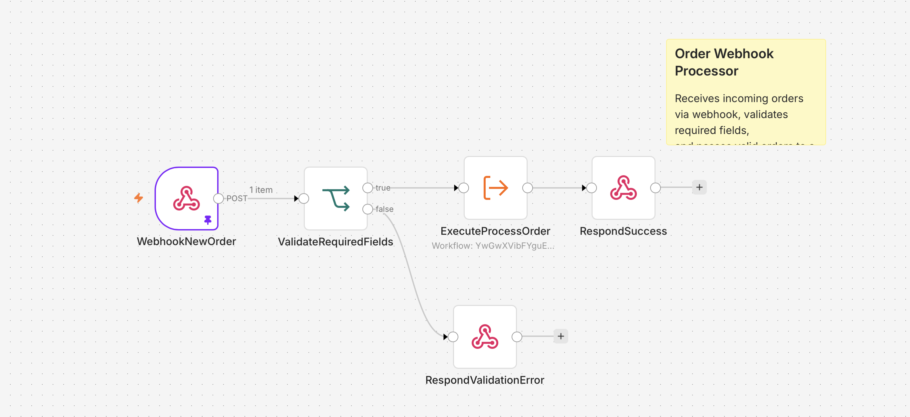
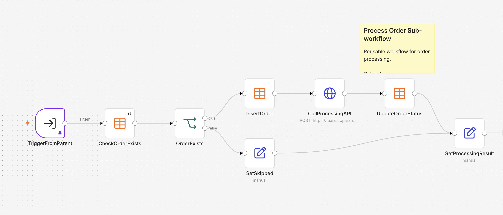
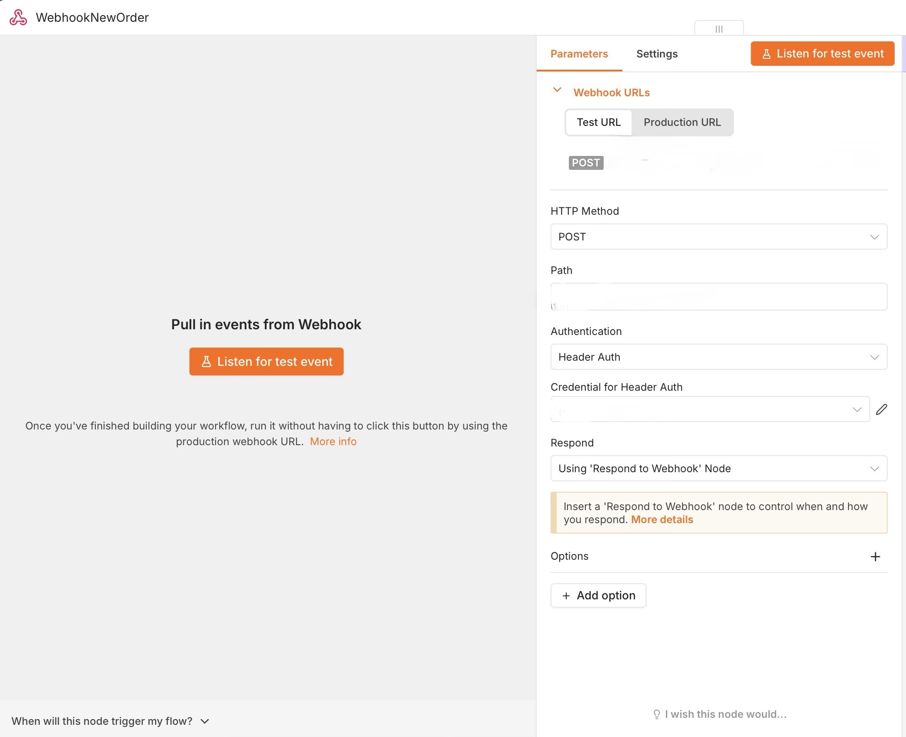
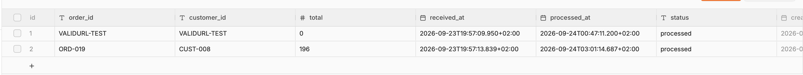

# Webhook-Driven Order Processing System

A modular order-processing automation built with **n8n**.

The system receives orders through a secure webhook, validates the incoming payload, prevents duplicate records, stores order data, delegates processing to a reusable sub-workflow, updates processing status, and returns a structured response to the caller.

## Overview

The project is split into two workflows:

1. **Order Webhook Processor** — receives and validates incoming requests, then calls the processing sub-workflow.
2. **Process Order Sub-workflow** — handles duplicate checks, data storage, API processing, status updates, and normalized output.

This separation keeps the main workflow simple while moving reusable business logic into a dedicated sub-workflow.

## Architecture

```text
Incoming Order
      |
      v
WebhookNewOrder
      |
      v
ValidateRequiredFields
   /            \
 valid          invalid
   |               |
   v               v
ExecuteProcessOrder   RespondValidationError
   |
   v
RespondSuccess
```

The processing sub-workflow:

```text
TriggerFromParent
      |
      v
CheckOrderExists
      |
      v
OrderExists
   /        \
 new       existing
  |            |
  v            v
InsertOrder   SetSkipped
  |
  v
CallProcessingAPI
  |
  v
UpdateOrderStatus
   \          /
    \        /
     v      v
 SetProcessingResult
```

## Key Features

- Secure webhook entry point using header-based authentication
- Required-field validation for:
  - `order_id`
  - `customer_id`
  - `total`
- Duplicate order detection
- Persistent order storage in an n8n Data Table
- Reusable sub-workflow architecture
- External API processing via HTTP Request
- Order status and processing timestamp updates
- Separate success and validation-error responses
- Consistent structured result returned to the parent workflow
- Duplicate orders are skipped instead of inserted again

## Main Workflow

**Workflow:** `Order Webhook Processor`

### Responsibilities

- Receives incoming `POST` requests
- Validates required fields
- Calls the processing sub-workflow
- Returns either:
  - a successful processing response, or
  - a validation error response

### Public Endpoint Example

```text
POST /orders/new-order
```

### Expected Input

```json
{
  "order_id": "ORD-1001",
  "customer_id": "CUST-501",
  "total": 299
}
```

### Example Success Response

```json
{
  "status": "accepted",
  "order_id": "ORD-1001",
  "message": "Order processed successfully",
  "stored": true,
  "stored_order": "...",
  "processed": true,
  "processing_result": "success"
}
```

### Validation Error Response

```json
{
  "status": "error",
  "message": "Missing required fields: order_id, customer_id, and total are required"
}
```

## Processing Sub-workflow

**Workflow:** `Process Order (Sub-workflow)`

### Inputs

| Field | Type |
|---|---|
| `order_id` | String |
| `customer_id` | String |
| `total` | Number |

### Processing Logic

1. Checks whether the order already exists in the Data Table.
2. If the order is new:
   - inserts it with status `received`
   - stores the current timestamp in `received_at`
   - sends the order to the processing API
   - updates `processed_at`
   - updates the order status with the processing result
3. If the order already exists:
   - skips re-insertion
   - marks the processing branch as `skipped`
4. Returns a normalized result to the parent workflow.

### Returned Fields

- `order_id`
- `stored`
- `stored_order`
- `processing_result`
- `processed_at`

## Data Model

The workflow uses a Data Table with the following fields:

| Column | Type | Purpose |
|---|---|---|
| `order_id` | String | Unique order identifier |
| `customer_id` | String | Customer identifier |
| `total` | Number | Order total |
| `received_at` | DateTime | Time the order was received |
| `processed_at` | DateTime | Time processing was completed |
| `status` | String | Current processing status |

## Duplicate Prevention

Before inserting a new record, the sub-workflow queries the Data Table using `order_id`.

If a matching row is found, the workflow follows the duplicate branch and avoids inserting the same order again.

This prevents repeated webhook calls from creating duplicate records.

## Project Files

```text
.
├── README.md
├── order-webhook-processor-public.json
├── process-order-subworkflow-public.json
└── screenshots/
    ├── 01-main-workflow.png
    ├── 02-sub-workflow.png
    ├── 03-webhook-config.png
    └── 04-order-data-table.png
```

## Screenshots

### Main Workflow



### Processing Sub-workflow



### Webhook Configuration



### Order Data Table



## Importing the Workflows

1. Import `process-order-subworkflow-public.json` into n8n.
2. Import `order-webhook-processor-public.json`.
3. Create or select an `orders` Data Table.
4. Reconnect the Data Table nodes to your table.
5. Configure your own header-auth credential.
6. Configure the processing API endpoint in `CallProcessingAPI`.
7. In the main workflow, select the imported `Process Order (Sub-workflow)` in `ExecuteProcessOrder`.
8. Publish or activate the workflows according to your n8n setup.

## Configuration Notes

The public JSON files intentionally do **not** include:

- secret API keys
- credential IDs
- personal instance URLs
- environment-specific workflow IDs
- test execution data
- private assessment or account metadata

After import, environment-specific credentials and resources must be configured manually.

## Tech Stack

- **n8n**
- **Webhooks**
- **HTTP Request**
- **Header Authentication**
- **Data Tables**
- **IF / conditional routing**
- **Edit Fields**
- **Sub-workflows**
- **JSON**

## What This Project Demonstrates

- Designing modular workflow automation
- Building reusable sub-workflows
- Validating inbound API requests
- Preventing duplicate data
- Persisting and updating workflow state
- Integrating external APIs
- Returning structured webhook responses
- Separating orchestration logic from processing logic

## Security

Sensitive credentials are not included in the repository.

When using this workflow in another environment:

- create your own authentication credentials
- use environment-specific API endpoints
- avoid committing secrets to Git
- keep production webhook endpoints protected

## License

This project is provided as a portfolio and reference implementation.
